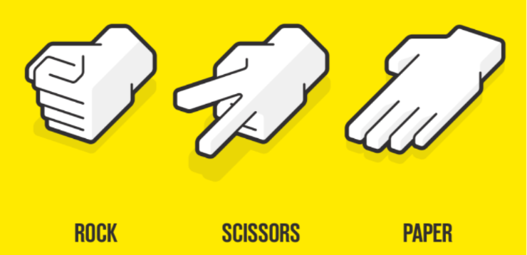
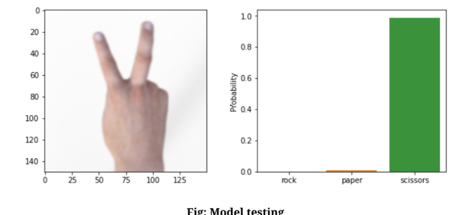

# Rock-Paper-Scissors classification of hand signs using Tensorflow ✂️

 In this project, we will build a CNN model using Tensorflow to recognize Rock-Paper-Scissors signs (gestures) in a photo. The rock is a closed fist; paper is a flat hand with fingers and thumb extended and the
palm facing downward; and scissors is a fist with the index and middle fingers fully extended. 

Dataset name: [rock_paper_scissors](https://www.tensorflow.org/datasets/catalog/rock_paper_scissors)

# Experimental Results

